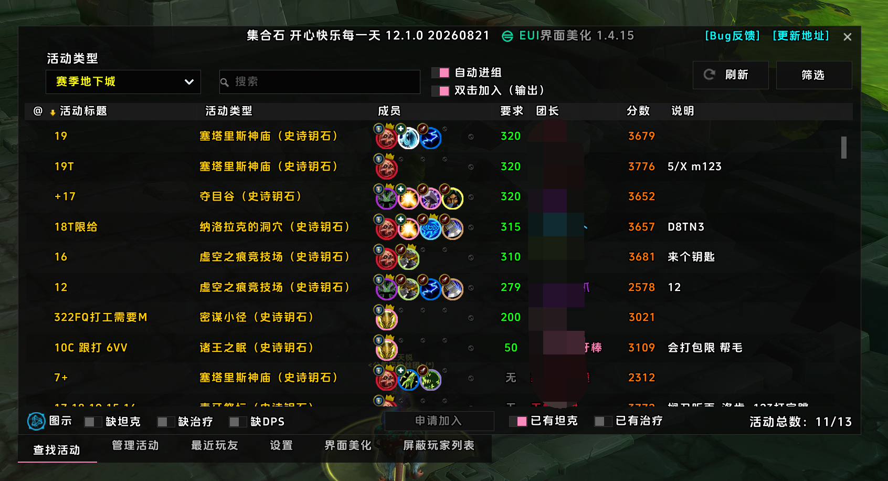
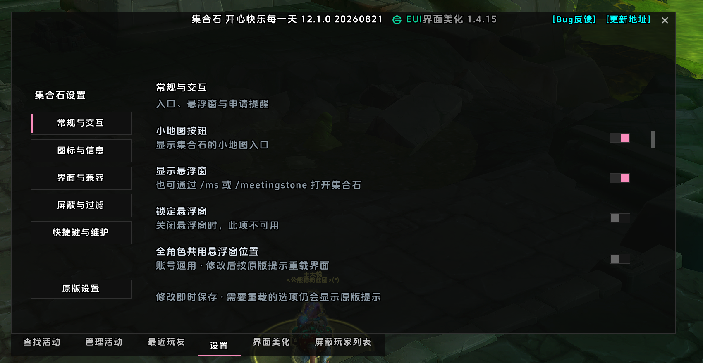
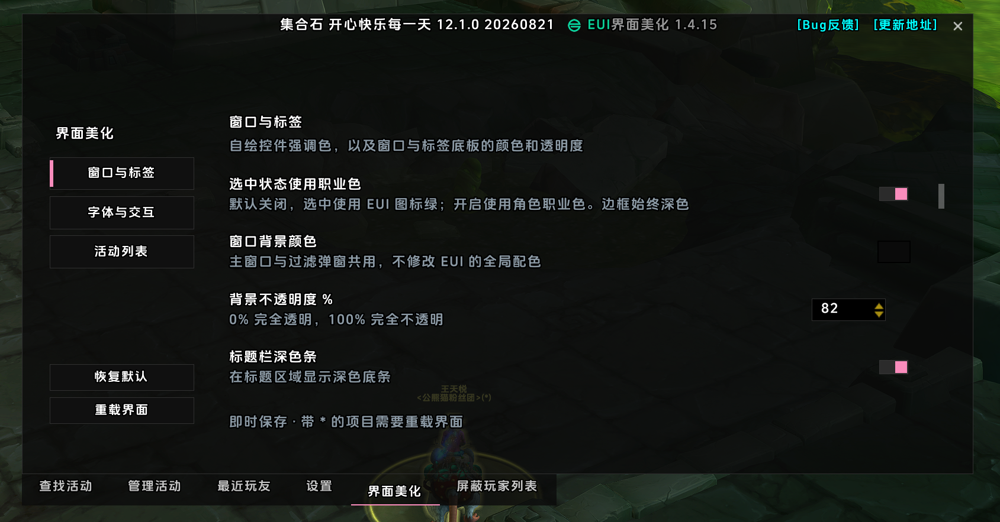
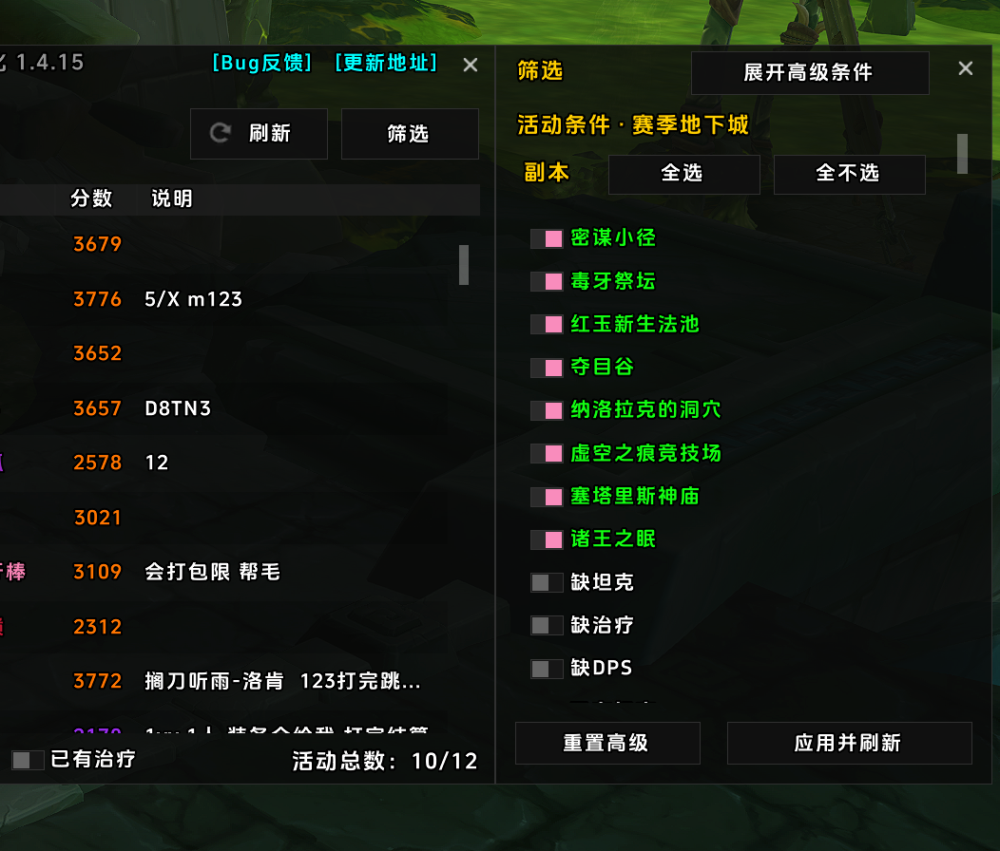
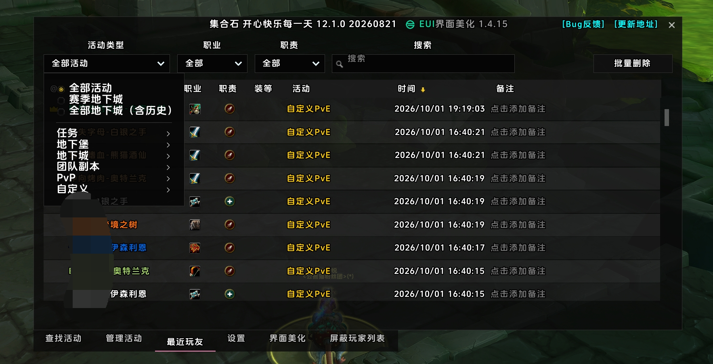

# MeetingStoneEllesmereUI

让**集合石**（MeetingStone / MeetingStone_Happy 开心快乐版）使用 [EllesmereUI](https://www.curseforge.com/wow/addons/ellesmereui) 风格的美化插件，统一界面外观，并优化设置、筛选和列表操作体验。

**当前版本：1.4.15** · **作者：白描** · **正式服**

[CurseForge 下载](https://www.curseforge.com/wow/addons/meetingstoneellesmereui) · [更新日志](CHANGELOG.md) · [问题反馈](https://github.com/Lianzy-Baimiao/MeetingStoneEllesmereUI/issues)

## 实际截图

以下均为游戏内实际截图。首页直接展示，其余截图点击标题展开。

### 首页



<details>
<summary>设置</summary>



</details>

<details>
<summary>界面美化</summary>



</details>

<details>
<summary>筛选</summary>



</details>

<details>
<summary>最近玩友</summary>



</details>

## 主要功能

- **统一外观**：深色面板、直角按钮、统一字体，覆盖首页、管理活动、最近玩友、设置、界面美化和屏蔽玩家列表。
- **重新设计设置页**：「设置」与「界面美化」采用一致的分类导航、对齐和留白；多数美化设置即时生效。
- **清晰的选中状态**：普通设置使用直角开关，列表多选保留方形复选框。选中默认使用 EUI 图标绿色，可选当前角色职业色；自绘边框始终深色。
- **统一筛选窗口**：普通过滤与高级过滤合并为一个「筛选」入口，支持展开高级条件、滚动查看、应用并刷新；赛季副本提供「全选 / 全不选」。
- **快捷职责筛选**：适用活动类型下显示首页底部快捷项，点击后刷新列表；关闭筛选窗口不会隐藏仍适用的快捷项。
- **完善列表与管理操作**：优化活动说明输入区、邀请/拒绝按钮和刷新按钮；完善最近玩友活动筛选及屏蔽列表全选/取消全选。
- **准确的报名提示**：双击加入后的括号显示当前专精对应职责，避免与地下城查找器的多选职责混淆。

本插件复用集合石及 MeetingStoneEX 的原控件、保存回调和邀请流程，并对筛选刷新、互斥选项、列表全选等做有限适配；**不会改写它们的插件源文件**。

## 依赖与兼容

使用前请安装并启用：

- **集合石**（MeetingStone / MeetingStone_Happy 开心快乐版）。
- **[EllesmereUI](https://www.curseforge.com/wow/addons/ellesmereui)**，以及提供皮肤接口的 **EllesmereUIBlizzardSkin / Blizz UI Enhanced** 组件，并开启相应第三方插件美化。

**MeetingStoneEX 为可选增强**：部分赛季副本、职责筛选及屏蔽列表功能依赖其提供的控件，以当前安装版本为准。

> 1.4.15 仍依赖 EllesmereUI 的皮肤接口，暂不支持完全脱离 EllesmereUI 独立运行。这里的 EUI 指 EllesmereUI，不是 ElvUI。

支持的 Interface 标记：`120000 / 120001 / 120005 / 120007 / 120100`。

## 安装与更新

1. 从 [CurseForge](https://www.curseforge.com/wow/addons/meetingstoneellesmereui) 下载发布包。
2. 将包内的 `MeetingStoneEllesmereUI` 文件夹放入：

   ```text
   World of Warcraft/_retail_/Interface/AddOns/
   ```

3. 启用上述依赖和本插件，进入游戏后打开集合石。
4. 在「界面美化」中调整样式。更新文件后输入 `/reload` 加载新版。

从 GitHub 下载源码 ZIP 时，请将包含 `.toc` 文件的目录命名为 `MeetingStoneEllesmereUI`，不要保留 `-main` 后缀。

## 界面美化选项

| 分类 | 可调整内容 |
| --- | --- |
| 窗口与标签 | 选中职业色、窗口背景颜色/透明度、顶部暗带、表头明暗、标签背景颜色/透明度 |
| 字体与交互 | 列表/标签/按钮字号、其他文字字号偏移、快捷职责筛选、成员图标缩放、旧版筛选弹窗兼容选项 |
| 活动列表 | 行美化、斑马纹、悬停/选中透明度、选中竖条及宽度 |

「选中状态使用职业色」默认关闭：关闭使用 **EUI 图标绿**，开启使用**当前角色职业色**，不影响自绘边框颜色。多数设置即时生效；关闭行美化等少数改动需要重载。

设置保存在 `MeetingStoneEllesmereUIDB`，不覆盖集合石或 EllesmereUI 的配置。

## 开发与验证

| 文件 | 职责 |
| --- | --- |
| `Core.lua` / `Config.lua` | 启动、共享工具、默认设置与刷新注册 |
| `Widgets.lua` / `Controls.lua` | 通用控件、开关、列表多选与申请操作按钮 |
| `BrowseInputs.lua` / `BrowseJoinControls.lua` | 首页输入控件和当前专精职责提示 |
| `UnifiedFilters.lua` | 合并筛选窗口与副本批量选择 |
| `SettingsLayout.lua` / `NativeSettings.lua` / `Options.lua` | 两个设置页的统一布局与配置适配 |
| `TablePanels.lua` / `Panels.lua` | 管理活动、最近玩友、屏蔽列表与面板接入 |
| `tests/` / `docs/` | 离线回归测试与设计说明 |

在仓库根目录执行（需要 Python 和 `lupa`）：

```sh
python -m pip install lupa
python -m unittest discover -s tests -q
python tests/build_release.py
```

构建脚本会运行完整测试、检查 Lua 5.1 语法，并在仓库上一级生成发布 ZIP。发布包不包含测试、截图或开发文档。当前有 **160 项离线回归测试**；游戏内最终观感和交互仍需人工验证。

## License

[MIT](LICENSE)
